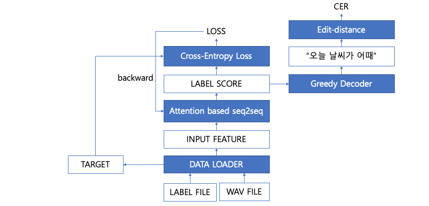
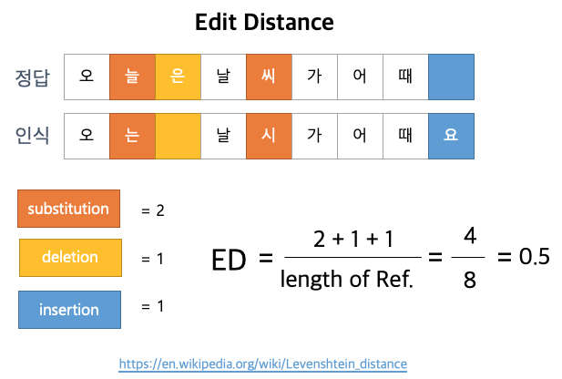

# 2019 해커톤 SPEECH
### 해커톤 홈페이지
https://campaign.naver.com/aihackathon_speech/
### 등록 사이트
https://campaign.naver.com/aihackathon_speech/popup.nhn

## Data
### Data format
* 음성 데이터 : 16bit, mono 16k sampling PCM, WAV audio
* 정답 스크립트 : 코드와 함께 제공되는 character level dictationary를 통해서 인덱스로 변환된 정답
  ```js
  "네 괜찮습니다." => "715 662 127 76 396 337 669 662"
  ```

### Dataset folder structure
```
* DATASET-ROOT-FOLDER
|--train
   |--train_data
      +--data_list.csv
      +--a.wav, b.wav, c.wav ...
   +--train_label
|--test
|--test_submit

```

* data_list.csv
  ```
  <wav-filename>,<script-filename>
  wav_001.wav,wav_001.label
  wav_002.wav,wav_002.label
  wav_003.wav,wav_003.label
  wav_004.wav,wav_004.label
  wav_005.wav,wav_005.label
  ...
  ```

* train_label
  ```
  <filename>,<script labels>
  wav_001,574 268 662 675 785 661 662 
  wav_002,715 662 545 566 441 337 669 662 
  wav_003,628 9 625 662 408 690 2 125 71 662 220 630 610 749 62 661 123 662
  wav_004,384 638 610 533 784 662 130 602 662 179 192 661 123 662  
  ...
  ```

## Baseline
### Feature
* spectrogram

  parameter | value
  ------|-----
  N_FFT | 512
  hop length | 10ms
  window length | 30ms
  window function | hamming window
  
* code
  ```python
  def get_spectrogram_feature(filepath):
    (rate, width, sig) = wavio.readwav(filepath)
    sig = sig.ravel()

    stft = torch.stft(torch.FloatTensor(sig),
                        N_FFT,
                        hop_length=int(0.01*SAMPLE_RATE),
                        win_length=int(0.030*SAMPLE_RATE),
                        window=torch.hamming_window(int(0.030*SAMPLE_RATE)),
                        center=False,
                        normalized=False,
                        onesided=True)

    stft = (stft[:,:,0].pow(2) + stft[:,:,1].pow(2)).pow(0.5);
    amag = stft.numpy();
    feat = torch.FloatTensor(amag)
    feat = torch.FloatTensor(feat).transpose(0, 1)

    return feat
    ```


### Architecture


### Model
```python
model DataParallel(
  (module): Seq2seq(
    (encoder): EncoderRNN(
      (input_dropout): Dropout(p=0.2)
      (conv): Sequential(
        (0): Conv2d(1, 32, kernel_size=(41, 11), stride=(2, 2), padding=(20, 5))
        (1): BatchNorm2d(32, eps=1e-05, momentum=0.1, affine=True, track_running_stats=True)
        (2): Hardtanh(min_val=0, max_val=20, inplace)
        (3): Conv2d(32, 32, kernel_size=(21, 11), stride=(2, 1), padding=(10, 5))
        (4): BatchNorm2d(32, eps=1e-05, momentum=0.1, affine=True, track_running_stats=True)
        (5): Hardtanh(min_val=0, max_val=20, inplace)
      )
      (rnn): GRU(4128, 512, num_layers=3, batch_first=True, dropout=0.2)
    )
    (decoder): DecoderRNN(
      (input_dropout): Dropout(p=0.2)
      (rnn): GRU(512, 512, num_layers=3, batch_first=True, dropout=0.2)
      (embedding): Embedding(820, 512)
      (attention): Attention(
        (linear_out): Linear(in_features=1024, out_features=512, bias=True)
      )
      (out): Linear(in_features=512, out_features=820, bias=True)
    )
  )
)
```

## Leader board
### Score
```
CRR = (1.0 - CER) * 100.0
```
* CRR : Character Recognition Rate
* CER : Characater Error Rate based on Edit Distance


### 모델 등록 & 평가
* 모델 등록/평가를 위해서 다음의 함수들을 직접 만든 모델에 맞게 작성
   ```python
   def bind_model(...):
      def save(path, **kwargs)
         # path 폴더 안에 모델을 저장하는 코드를 작성
      def load(path, **kwargs)
         # path 폴더 안에 저장된 모델을 로딩하는 코드 작성
      def infer(wavfile_path)
         # wavfile_path에 있는 wav를 읽어서 주어진 모델을 통해 inference한 결과를 리턴하는 코드 작성
         
   nsml.bind(save=save, load=load, infer=infer)
   ```

## Usage
### NSML Local
> NSML을 로컬 머신에서 실행하여 초기 코드 작성 및 디버깅을 빠르게 진행함
#### 1. Installation
1. edit-distance library (Levenshtein)
  ```bash
  [hack]$ pip install python-Levenshtein
  ```
2. pytorch 
  * https://pytorch.org 에서 로컬 머신에 맞는 pytorch 설치 (1.0 이상 권장)
3. nsml local package
  ```bash
  [hack]$ pip install git+https://github.com/n-CLAIR/nsml-local
  ```
#### 2. Training
  ```bash
  [hack]$ ./run.sh
  ```
#### 3. 해커톤 데이터셋을 로컬에 다운받아서 학습하는 방법
1. 데이터셋 다운로드 받기
  ```bash
  [hack]$ nsml dataset pull sr-hack-2019-dataset [DOWNLOAD-PATH]
  ```
  
  * nsml을 cloud 환경으로 실행할 경우, 소스코드가 포함된 폴더를 전부 cloud로 업로드하기 때문에, 데이터셋은 nsml 소스코드 폴더와 다른 경로에 받아야 함
  
2. main.py에 데이터셋 경로 지정하기
  ```python
  #
  # ./main.py
  # 
  
  if HAS_DATASET == False:
    DATASET_PATH = './sample_dataset' # 이 값을 데이터셋 다운로드 경로로 변경
  ```
  
3. Training
  ```bash
  [hack]$ ./run.sh
  ```
    
### NSML Cloud
> NSML이 제공하는 cloud 환경의 GPU를 사용해서 모델을 학습 & 등록함
#### 1. Training
  ```bash
  [hack]$ nsml run -g 1 -c 4 -d sr-hack-2019-dataset -a "--batch_size 8 --workers 2 --use_attention" 
  
  # (or ./run_nsml.sh)
  
  # -g : number of GPUs
  # -c : number of CPU cores
  # -d : dataset
  ```
#### 2. Leader board 등록하기
  ```bash
  [hack]$ nsml submit [SESSION] [CHECKPOINT]
  
  # baseline에서 기본으로 저장하는 체크포인트 목록
  #
  # 'model' : 매 epoch마다 자동 저장되는 체크포인트
  # 'best' : evaluation loss가 가장 좋은 모델을 저장하는 체크포인트
  # 
  # 저장된 체크포인트 목록 확인 방법
  #
  # nsml model ls [SESSION] 
  
  ```
  
## Reference
* Feature & Baseline
   * [feature](./docs/speech_hackathon_2019_chapter_1.pdf)
   * [baseline](./docs/speech_hackathon_2019_chapter_2.pdf)
* NSML Document
   * https://n-clair.github.io/airush-docs/_build/html/ko_KR/index.html
* Model
   * IBM pytorch-seq2seq (https://github.com/IBM/pytorch-seq2seq) 모델 사용
   
## License

```
Copyright 2019-present NAVER Corp.

Licensed under the Apache License, Version 2.0 (the "License");
you may not use this file except in compliance with the License.
You may obtain a copy of the License at

    http://www.apache.org/licenses/LICENSE-2.0

Unless required by applicable law or agreed to in writing, software
distributed under the License is distributed on an "AS IS" BASIS,
WITHOUT WARRANTIES OR CONDITIONS OF ANY KIND, either express or implied.
See the License for the specific language governing permissions and
limitations under the License.
```
```
이 곳에서 배포되는 모든 자료들(배포되는 음성 데이터등 일체의 자료를 의미하며, 이하 '대상 데이터등'이라 한다)에 대해서는 Github에 고지된 clovaai/speech_hackathon_19 License(Apache Lincese 2.0) 우선하여 다음과 같은 License가 적용됩니다.

데이터등은 비상업적인(NON-COMMERCIAL)인 AI 연구, 학습에서만 사용할 수 있으며, 상업적인 이용은 엄격히 금지됨.
데이터등은 제공된 그대로만 사용하여야 하며, 이를 수정, 변경 등 재가공하는 것음 엄격히 금지됨.
데이터등은 자신만 이용하여야 하며, 이를 제3자에게 임의로 제공하는 것은 엄격히 금지됨.
데이터등을 연구 등에서 비상업적으로 이용하는 경우에도 데이터의 출처를 [NAVER Corp]로 표시하여야 함.
네이버는 제공되는 데이터등의 완전성이나 무결성, 정합성, 정확성, 적절성 등을 보증하지 않으며, 따라서 그에 대한 책임을 부담하지 않음.
※ 제공되는 데이터등은 음성제공자가 제공하면서 동의한 범위 내에서만 사용되어야 하므로, 상업적 이용 등 그를 넘어 이용할 경우 음성제공자 사이와의 관계에서도 법적인 책임을 부담할 수 있으므로, 반드시 위 제한사항을 준수하여 사용하시기 바랍니다.
```
