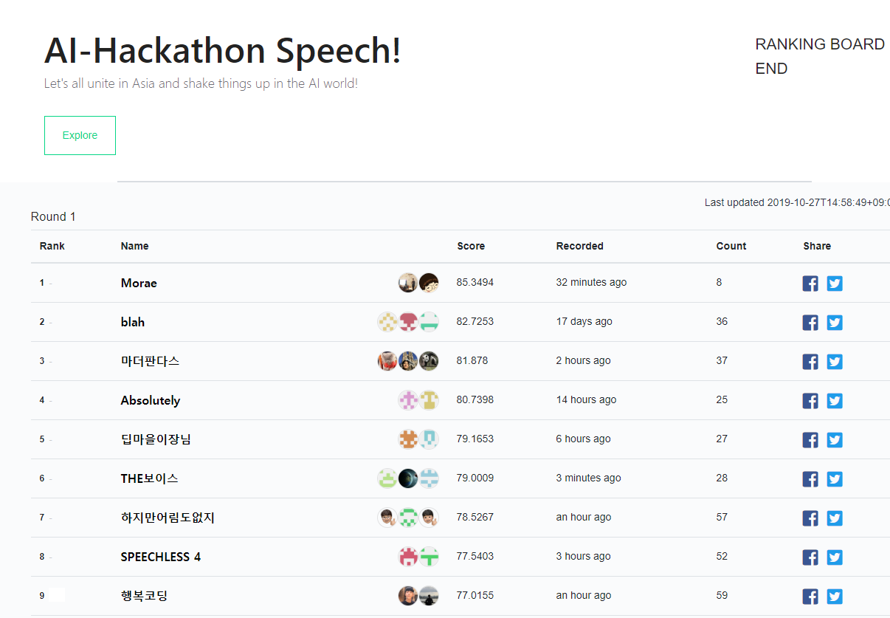

# NAVER AI HACKATHON 2019 - Speech To Text
We participated in [NAVER_AI_HACKTHON 2019](https://github.com/Naver-AI-Hackathon/AI-Speech) and ranked 9th(77.0155) as a two-man team(Hangbok Coding, 행복코딩).
* 박승일(Seungil Park) [github repo](https://psi9730.github.io/)
* 이진호(Jinho Lee)    [github repo](https://github.com/elzino)

## Final Leaderboard


## Features
* Convolution feature extraction (deepspeech style)
* Seq2Seq (bidirectional GRU encoder, unidirectional GRU decoder with Bahdanau Attention)
* Augmentation with log mel spectrogram (SpecAugment)
* Beam-search
* Data preprocessing (deleted blank and special characters)
* Label Smoothing
* Multi step learning rate
* Ensemble (but not used for best model)

## Data
Naver has released approximately 100 hours of 16kHz Korean speech data. <br/>
* Download links : [data part 1](https://drive.google.com/open?id=1UOspFSTJ2w0wsENIeD6Ilcy5dd4NTsDV) / [data part 2](https://drive.google.com/open?id=1Bh0vodkng3_SF7lLa82KePv6S7jzYEQV) <br/>

### Data format
* Audio data : 16bit, mono 16k sampling PCM, WAV audio
* Target script : Korean characters are converted to the indices according to the 'hackathon.labels' file
  ```js
  "네 괜찮습니다." => "715 662 127 76 396 337 669 662"
  ```

### Dataset folder structure
```
* DATASET-ROOT-FOLDER
|--train
   |--train_data
      +--data_list.csv
      +--a.wav, b.wav, c.wav ...
   +--train_label
```

* data_list.csv
  ```
  <wav-filename>,<script-filename>
  wav_001.wav,wav_001.label
  ...
  ```

* train_label
  ```
  <filename>,<script labels>
  wav_001,628 9 625 662 408 690 2 125 71 662 220 630 610 749 62 661 123 662
  ...
  ```

## How to RUN

### Docker
```bash
$ docker build -t model:0.0 .
$ docker run -i --name model model:0.0
$ docker exec -i -t model /bin/bash
$ ./run.sh
```

### NSML
Login with nsml first, and run commands as follows:
```bash
$ ./run.sh # for local training
$ ./run_nsml.sh  # for NSML training
$ nsml submit (sessionName) (checkpoint) # for submit
```

## Hyperparameters
| Help        | default           |  |
| ------------- |:--------:| ------:|
| hidden size of model | 256 | --hidden_size | 
| size of embedding dimension | 64 | --embedding_size |
| number of layers of encoder | 4 | --encoder_layer_size |
| number of layers of decoder | 3 | --decoder_layer_size |
| batch size | 32 | --batch_size |
| initial learning rate | 1e-04 | --lr |
| teacher forcing | 0.5 | --teacher_forcing|
| maximum characters of sentence | 80 | --max_len |

## Reference
1. [Listen, Attend and Spell](https://arxiv.org/abs/1508.01211)
2. [Label Smoothing](https://arxiv.org/abs/1906.02629)
3. [SpecAugment](https://arxiv.org/abs/1904.08779)
4. [Naver's baseline code](https://github.com/clovaai/speech_hackathon_2019)

## License
Copyright 2019 Hangbok Coding.
```
Permission is hereby granted, free of charge, to any person obtaining a copy of this software and
associated documentation files (the "Software"), to deal in the Software without restriction, including
without limitation the rights to use, copy, modify, merge, publish, distribute, sublicense, and/or sell
copies of the Software, and to permit persons to whom the Software is furnished to do so, subject to
the following conditions:

The above copyright notice and this permission notice shall be included in all copies or substantial
portions of the Software.

THE SOFTWARE IS PROVIDED "AS IS", WITHOUT WARRANTY OF ANY KIND, EXPRESS OR IMPLIED,
INCLUDING BUT NOT LIMITED TO THE WARRANTIES OF MERCHANTABILITY, FITNESS FOR A
PARTICULAR PURPOSE AND NONINFRINGEMENT. IN NO EVENT SHALL THE AUTHORS OR COPYRIGHT
HOLDERS BE LIABLE FOR ANY CLAIM, DAMAGES OR OTHER LIABILITY, WHETHER IN AN ACTION OF
CONTRACT, TORT OR OTHERWISE, ARISING FROM, OUT OF OR IN CONNECTION WITH THE SOFTWARE
OR THE USE OR OTHER DEALINGS IN THE SOFTWARE.
```